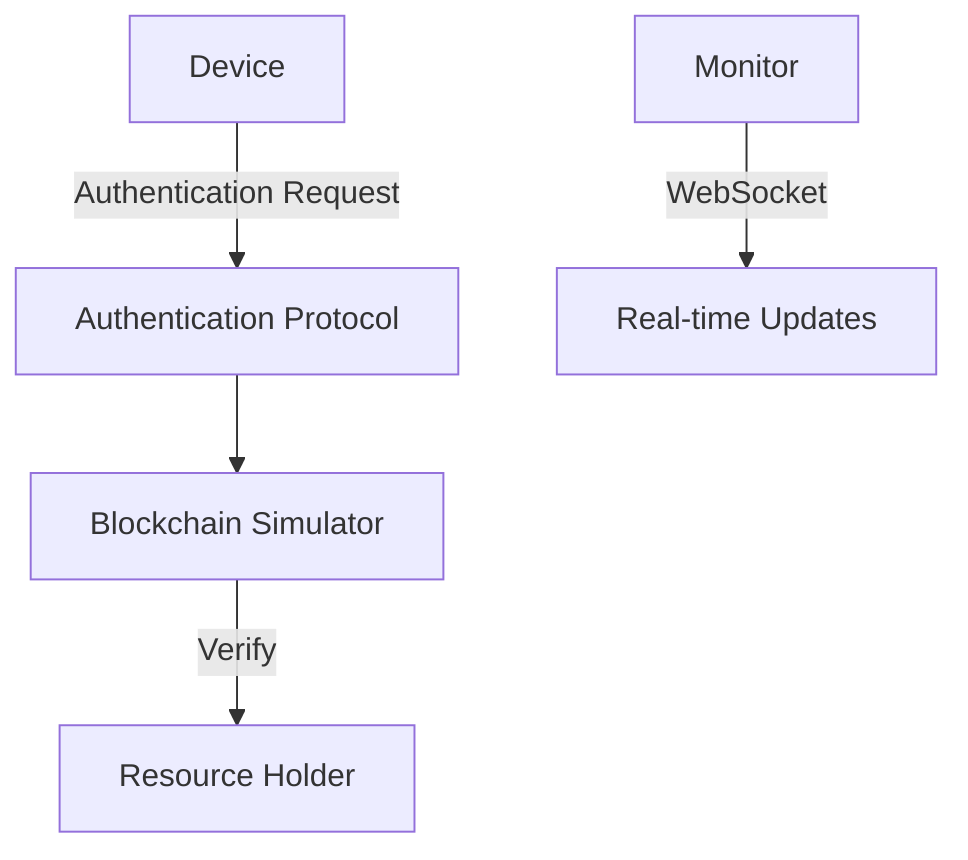

# IOTSIM - Secure IoT Authentication Simulator

## Overview

IOTSIM is a robust IoT authentication simulator that demonstrates the BasIoT protocol implementation. It provides a comprehensive simulation environment for testing and understanding various IoT security scenarios, including device authentication, secure connections, and potential security threats.

## Features

### 1. Authentication Simulation
- Legitimate device authentication
- Hacker attempt simulation
- Expired request handling
- Replay attack detection
- Real-time security monitoring

### 2. Secure Device Communication
- Device-to-device secure connection simulation
- RSA key pair generation
- Perfect Forward Secrecy with ephemeral keys
- Challenge-response authentication
- Visual key matching verification

### 3. Real-time Monitoring
- WebSocket-based real-time monitoring
- Authentication metrics tracking
- Security event logging
- Visual representation of system state

### 4. Visualization Features
- ASCII art animations for connection states
- Color-coded status messages
- Key generation and matching visualization
- Step-by-step process demonstration

## Technical Details

### Requirements
- Go 1.19 or later
- Gorilla WebSocket package
- Node.js runtime environment 
- Modern terminal with color support

### Installation

1. Clone the repository:
```bash
git clone https://github.com/exprays/iotsim.git
cd iotsim
```

2. Install dependencies:
```bash
go mod init iotsim
go get github.com/gorilla/websocket
```

3. Build the project:
```bash
go build
```

4. Run the simulator:
```bash
./iotsim
``` 
or you can just run
```bash
go run main.go
```

### Starting the monitor dashboard

1.Make sure you have node.js runtime installed in your machine.

2.Navigate to frontend
```bash
cd frontend
```

3.Install dependencies
```bash
npm install
```

4.Run the node dev server
```bash
npm run dev
```

## Usage

### Main Menu Options
1. **Legitimate Authentication** - Simulate normal device authentication
2. **Hacker Attempt** - Test security against unauthorized access
3. **Expired Request** - Demonstrate timeout handling
4. **Replay Attack** - Show protection against replay attacks
5. **Device Connection** - Simulate secure device-to-device communication
6. **Exit** - Close the simulator

### Example Simulation

```bash
# Start the simulator
go run main.go

# Select option 5 for device connection simulation
5

# Watch the secure connection process:
- Key generation
- Public key exchange
- Challenge-response authentication
- Shared secret establishment
```

## Security Features

### Authentication Protocol
- RSA-2048 key pairs for device identity
- SHA-256 hashing for message integrity
- Timestamp validation
- Nonce-based replay protection
- Digital signatures using PKCS1v15

### Device Connection Security
- Perfect Forward Secrecy
- Ephemeral key generation
- Challenge-response verification
- Secure shared secret establishment
- Key fingerprint visualization

## Architecture



## Contributing

1. Fork the repository
2. Create your feature branch (`git checkout -b feature/AmazingFeature`)
3. Commit your changes (`git commit -m 'Add some AmazingFeature'`)
4. Push to the branch (`git push origin feature/AmazingFeature`)
5. Open a Pull Request

## License

This project is licensed under the MIT License - see the [LICENSE.md](LICENSE.md) file for details

## Acknowledgments

- Created by exprays (surya)
- Inspired by real-world IoT security challenges
- Built for educational and demonstration purposes

## Contact

- Creator: exprays
- Email: surya@thestarsociety.tech
- For contribution guidelines and other info: suryakantsubudhi@protonmail.com
- Project Link: https://github.com/exprays/iotsim

## Disclaimer

This simulator is designed for educational purposes and should not be used as a production security system. While it demonstrates security concepts, it may not implement all necessary security measures for real-world applications. Currently this is in development stage so you can expect bugs🐞!! Email suryakantsubudhi@protonmail.com for bug reports.
