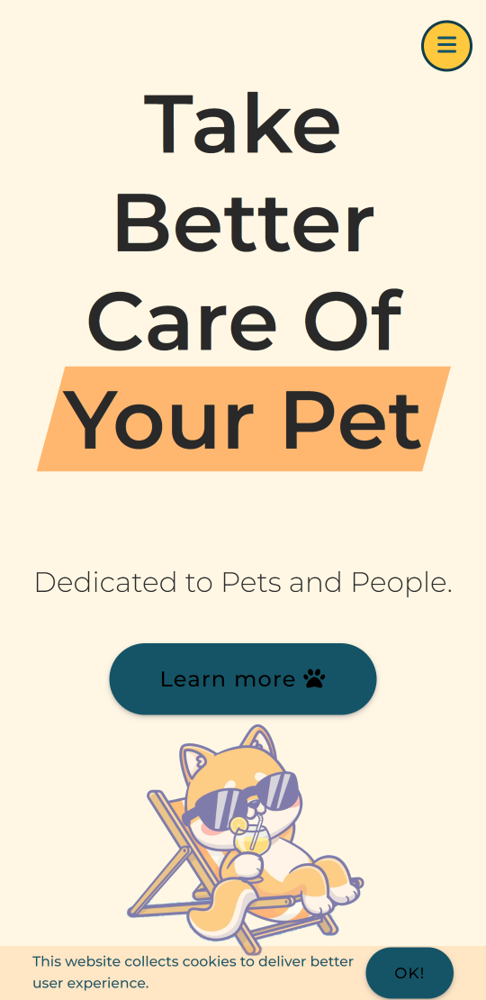
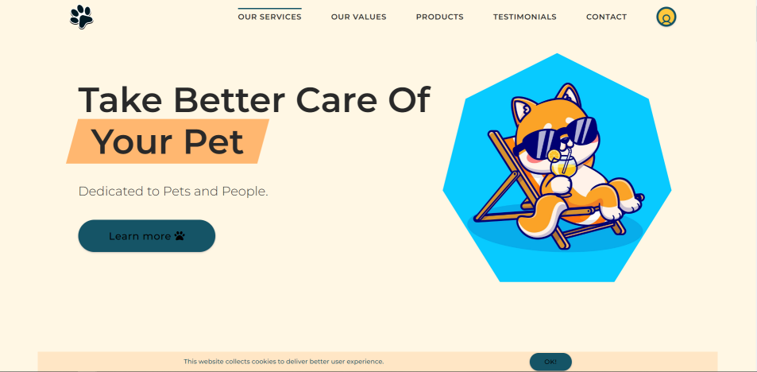

# Pet Care Website

This is a Pet Care Website which I just made after learning some JavaScript from Jonas Schmedtmann's course.
At first, I just wanted to practice the course material. Finally, I made my own version of the site and added a few things.
In course, the site wasn't responsive, that's why I starded from Desktop view (Usually I use the “mobile first” principle).

### Project summary/ observations

- I am very proud to have done this project. I spent some time on it. I analyzed the code from the project in great detail (especially the CSS one) and used it in my project. I've learned to better use class naming in CSS. I haven't used BEM before, so my class names were sometimes chaotic. It was very helpful.
- I am well aware that my code is too long. I should use SASS/SCSS here, not pure CSS. Which would allow me to shorten the code (But as I mentioned before, I just wanted to practice at first, not do the whole page.. ^^'),
- It should certainly start with the mobile view. The transition from desktop to mobile gave me a problem. It's not perfect, but I wasn't focusing too much on it.

## Page contains:

- Screen transitions,
- Testimonial slider,
- Tabbed component,
- Images lazy-loading,
- Modal windows (login/registration forms, contact form),
- Sticky navigation,
- Scroll Up Button,
- Hover states for all interactive elements on the page,
- The optimal layout for the site depending on their device's screen size

## Screenshot

## Built with

- Semantic HTML5 markup
- CSS3
- Pseudo-elements
- Flexbox and Grid
- Desktop-first workflow
- JS
- Photoshop

## Photos

- All images are from freepik.com [@catalyststuff](https://www.freepik.com/author/catalyststuff)
